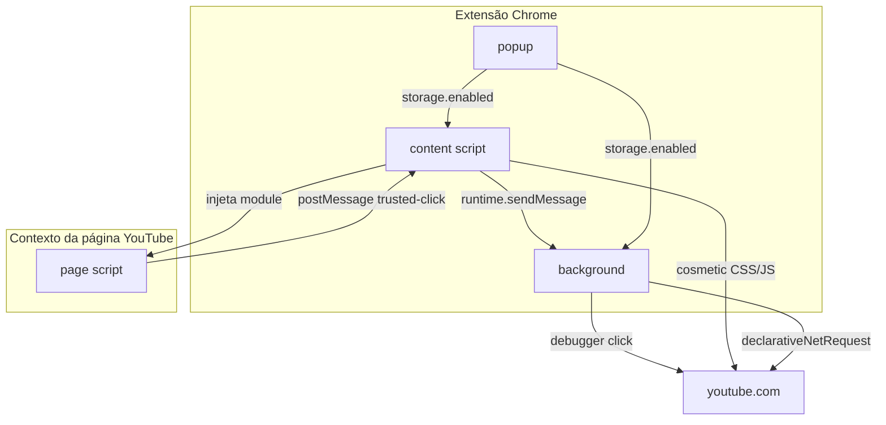

# Arquitetura — YouTube Clean Player

Extensão Chrome MV3 organizada em módulos ES no código-fonte (`src/`). O Chrome carrega os arquivos compilados em `dist/` (gerados com esbuild).

## Build

```bash
npm install
npm run build
```

O `manifest.json` aponta para `dist/`, não para `src/` diretamente. Isso evita o erro `Cannot use import statement outside a module`.

## Fluxo geral



## Camadas de bloqueio

| Camada | Módulo | O que faz |
|--------|--------|-----------|
| Rede | `background/network-rules.js` | Bloqueia requests de ads antes de carregar |
| Cosmético | `content/cosmetic.js` + `styles/cosmetic.css` | Esconde elementos promocionais no DOM |
| Vídeo | `page/ad-handlers.js` | Avança anúncios em vídeo curtos (≤ 120 s) |
| Estático | `page/skip-button.js` + `background/trusted-click.js` | Clica em **Pular** com mouse real |

## Módulos

### `src/shared/`

Constantes (`constants.js`) e seletores CSS (`selectors.js`) usados por background, content, page e popup.

### `src/background/`

Service worker em ES module.

- `network-rules.js` — liga/desliga o ruleset `ads` conforme `storage.enabled`
- `trusted-click.js` — recebe coordenadas do botão Pular e envia clique via `chrome.debugger`
- `index.js` — ponto de entrada

### `src/content/`

Roda no contexto isolado da extensão em `youtube.com`.

- `injector.js` — injeta `src/page/index.js` como `<script type="module">`
- `cosmetic.js` — observa o DOM e esconde promoções
- `bridge.js` — sincroniza flag `enabled` no `dataset` e repassa `postMessage` ao background
- `stats.js` — contadores salvos em `chrome.storage.local`
- `index.js` — orquestra a inicialização

### `src/page/`

Roda no **contexto da página** (mesmo JS do YouTube). Necessário para interagir com o player e enviar coordenadas do botão Pular.

- `dom.js` — helpers de player/vídeo/visibilidade
- `mute.js` — muta anúncios e restaura volume depois
- `skip-button.js` — encontra botão Pular e pede clique confiável
- `ad-handlers.js` — distingue anúncio em vídeo vs estático
- `controller.js` — timers e evento `yt-navigate-finish`
- `index.js` — guard contra dupla injeção

### `src/popup/`

Interface simples: toggle global, contadores e última ação.

### `rules/ads.json`

16 regras estáticas MV3 (`declarativeNetRequest`). Domínios Google Ads + endpoints do YouTube.

## Comunicação entre contextos

| De | Para | Canal |
|----|------|-------|
| page | content | `window.postMessage` |
| content | background | `chrome.runtime.sendMessage` |
| popup | background/content | `chrome.storage.onChanged` |
| page | content | `document.documentElement.dataset.cleanPlayerEnabled` |

## Por que três contextos?

1. **Content script** — acesso à API da extensão (`chrome.storage`, `runtime`)
2. **Page script** — leitura do player do YouTube no mesmo contexto da página
3. **Background** — `declarativeNetRequest` e `chrome.debugger` (não disponíveis no content script para clique confiável)

## Manutenção quando o YouTube mudar

1. Anúncio estático não pula → `selectors.js` + `skip-button.js`
2. Anúncio em vídeo não acelera → `ad-handlers.js` (limite de duração / marcadores estáticos)
3. Banners voltam → `selectors.js` + `cosmetic.css`
4. Vazamento de rede → `rules/ads.json`
